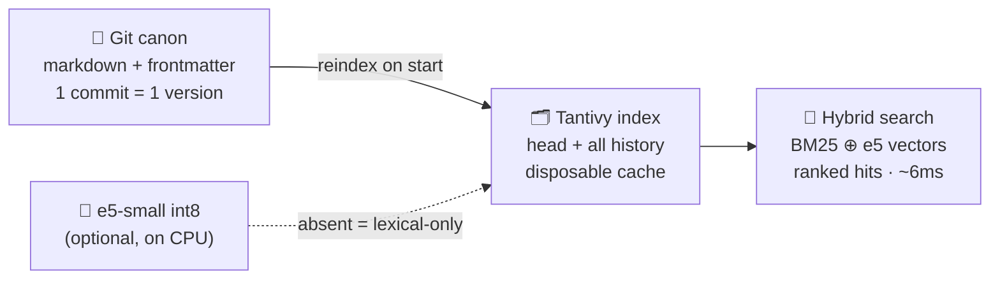

<div align="center">


# KYB — Know Your Business

**The shared memory your AI agent fleet keeps forgetting it needs.**

A git-backed, searchable knowledge base and incident tracker for fleets of AI agents.
Which servers exist, how services are wired, what broke and how it ended — the operational
truth that survives between sessions and across machines.

<br/>

[](LICENSE)
[](#stack--tests)
[](#stack--tests)
[](Cargo.toml)
[](#search-quality)

<br/>

[**Quick start**](#quick-start) · [**How it works**](#how-it-works) · [**Incidents**](#incident-reports) · [**Agent skill**](#the-agent-skill) · [**HTTP API**](#http-api)

</div>

---

## Why

> Agents forget everything between sessions. Multiple agents — Claude Code, Codex,
> Antigravity — on multiple machines rediscover the same infrastructure over and over,
> and every hard-won incident lesson evaporates the moment the context window closes.

KYB is the shared memory that survives: which servers exist and what runs on them, how
services are wired, how they deploy, which decisions were made and why — plus **incident
reports**: what broke, the impact, how to live with it, and how it ended.

---

## How it works

- **Git is the canon — there is no database.** One markdown file (YAML frontmatter + body)
  per entry — under `knowledge/`, `incidents/` or `tasks/` by kind — one commit per change,
  **a commit sha is a version id**. History, diff and rollback come for free; the canon can
  be read and edited with any text editor. (Flat pre-v2 canons migrate themselves on start.)
- **The tree holds only what is live.** Closing an incident or a task *archives* it: the
  file leaves the working tree, but the final version — resolution included — stays in the
  **default search**, in the listings and in `GET` (marked `archived`). Deleting plain
  knowledge is a *retraction* and drops it from the default search. Git keeps everything
  either way.
- **Tantivy is the index** — a disposable cache rebuilt from git on every start. It covers
  the latest version of every key *and every historical version*, so agents can search what
  the knowledge said before it changed (`--history`: "what moved where").
- **Search is hybrid** — BM25 fused (reciprocal rank) with vector search over every entry
  (multilingual-e5-small, int8 ONNX, runs locally on CPU in ~5 ms). Ask in one language about
  a base written in another and it lands; exact technical terms still rank first. No model on
  disk → the service runs lexical-only.
- **Writes are upserts by key** — a no-op when content did not change. Flat key space plus
  tags; no projects, no namespaces.
- **Secrets never enter the base** — writes are rejected if the body looks like a token, a
  private key or a password. Store pointers instead.

### Architecture



---

## Incident reports

Incidents are first-class entries (`kind: incident`, keys prefixed `inc-`) with a lifecycle
`open → mitigated → resolved` and a rule: **closing requires a resolution** — an incident
that ends with "it just went away" teaches nobody anything. A report is a *control panel, not
a story*:

| Field | What it gives an agent |
|---|---|
| `detection` | an executable "is it still happening?" check, with the expected healthy result |
| `affected` | machine-readable poisoned windows `[{scope, from, to}]` — a backtest excludes them programmatically |
| `knowledge` | links to the knowledge entries the incident concerns |
| `resolution` | how it ended — searchable, so "how did we fix this last time" has an answer |
| timeline | `started/detected/mitigated/resolved_at`; the server stamps status transitions |
| follow-ups | `- [ ]` checkboxes in the body; the server counts them and warns when closing over them |

The server teaches structure instead of gating on it: a bare report is accepted but the
reply carries `hints` naming the missing actionable parts. `kyb incident --template` prints
the canonical skeleton.

Resolving archives the report: the canon stays clean (open things only), the record stays
searchable forever.

---

## Tasks

The third kind (`kind: task`, keys prefixed `task-`): short actionable notes and ideas with
the same close-with-an-outcome discipline — `open → done | dropped`, **a resolution is
required either way** ("dropped: obsolete after the rewrite" is knowledge too) — and none of
the incident ceremony. Closing archives the task; `kyb tasks` and the search keep the full
record.

---

## Quick start

```bash
# docker — data (git canon + index) lives in ./data
docker compose up -d

# or natively — reindexes from git on start, listens on 127.0.0.1:9310
cargo run --release
```

<details>
<summary><b>Configuration</b> — env, all optional</summary>

| Variable | Default | Notes |
|---|---|---|
| `KYB_DATA` | `./kyb-data` | git canon directory |
| `KYB_INDEX` | `./index` | Tantivy cache (safe to delete) |
| `KYB_ADDR` | `127.0.0.1:9310` | **no auth by design** — run on a private network |
| `KYB_MODEL` | *(unset)* | dir with `model.onnx` + `tokenizer.json`; absent = lexical-only |
| `KYB_AUDIT` | `audit.jsonl` | JSONL request log |

</details>

---

## CLI

`skills/kyb/bin/kyb` (installed to `~/.local/bin/kyb`; point it anywhere with `KYB_ADDR=host:port`):

```bash
kyb query "nats streams" [--tag infra] [--history] [--recent] [--kind incident] [--status open] [--service X]
kyb tags                                    # which topics the base covers
kyb add --key nats-streams --title "..." --tags nats,infra <<< "body"    # upsert by key
kyb get nats-streams [--at <sha>]           # current or any historical version
kyb history nats-streams                    # the whole chain of changes

kyb incident --template                     # print the report skeleton
kyb incident --key inc-2026-07-22-orders-api-oom --title "..." --service orders_api \
             --severity high [--hosts host-a] [--knowledge orders-api-architecture] \
             [--detection "check + healthy result"] \
             [--affected '[{"scope":"...","from":"...","to":"..."}]'] <<< "body"
kyb incidents [--status X] [--service X] [--open-followups] [--all]   # live by default, --all adds archived
kyb resolve inc-2026-07-22-orders-api-oom <<< "what fixed it"   # resolution is mandatory; closing archives

kyb task --key task-raise-log-retention --title "..." [--tags idea] <<< "body"
kyb tasks [--status X] [--open-followups] [--all]               # open by default, --all adds archived
kyb done task-raise-log-retention <<< "what came of it"         # or --status dropped + why
```

---

## The agent skill

`bash skills/install.sh` installs, for **every agent found on the machine**:

- the CLI (one copy on PATH),
- the manual `SKILL.md`,
- a **pointer section in each agent's always-loaded global instructions** — a skill an agent
  never opens is a skill it never uses.

| Agent | Skill path | Pointer |
|---|---|---|
| Claude Code | `~/.claude/skills/kyb` | `CLAUDE.md` |
| Codex | `~/.codex/skills/kyb` | `AGENTS.md` |
| Antigravity | `~/.gemini/config/skills/kyb` | `GEMINI.md` |

Idempotent: sections are delimited by markers and updated in place. The skill encodes the
governance that keeps a shared base alive — always query before adding, overwrite the same
key instead of inventing synonyms, only verified facts, English entries, file incidents when
something breaks and fold the lesson back into knowledge after resolving.

---

## HTTP API

| Method | Path | What it does |
|---|---|---|
| `POST` | `/knowledge` | upsert by key. Body: `{key, title, body, tags?, refs?}` → `{key, sha, changed, action}`. Identical content = `changed:false`, no commit |
| `GET` | `/knowledge/{key}` | the entry (kind-specific fields included); archived incidents/tasks come back with `archived:true`; `?at=<sha>` returns a version from history |
| `GET` | `/knowledge/{key}/history` | `{key, versions:[{sha, committed_at, message, change}]}`, newest first |
| `POST` | `/incidents` | upsert a report; reply carries `unknown_knowledge` for dangling links and `hints` for missing structure. `status:resolved` requires `resolution` and archives |
| `GET` | `/incidents` | `?status=&service=&followups=open&all=true&limit=` — live reports by default, open first, freshest on top; `all=true`, an explicit `status=` or `followups=open` include archived ones |
| `POST` | `/incidents/{key}/resolve` | `{resolution, status?=resolved}` — flips status, records the outcome, stamps the timeline, archives on close |
| `POST` | `/tasks` | upsert a task: `{key, title, body, status?, knowledge?, resolution?, tags?, refs?}`; closing statuses require `resolution` and archive |
| `GET` | `/tasks` | `?status=&followups=open&all=true&limit=` — open tasks by default, freshest on top; same archive rules as `/incidents` |
| `POST` | `/tasks/{key}/resolve` | `{resolution, status?=done}` — close (`done`/`dropped`) with an outcome, archives |
| `GET` | `/search` | `?q=&tag=&history=&limit=&sort=recent&kind=&status=&service=` → ranked hits with full bodies; an empty `q` lists newest first |
| `GET` | `/tags` | which topics the base covers, most used first |
| `DELETE` | `/knowledge/{key}` | knowledge: retract (drops from the default search); incident/task: archive (stays searchable) |
| `POST` | `/reindex` | full index rebuild from git |
| `GET` | `/healthz` | `{ok, entries, open_incidents, open_tasks, index_docs, last_commit}` |

Every request except `/healthz` is appended to a JSONL audit log: timestamp, client ip,
method, path, query, status, duration.

---

## Search quality

`scripts/eval-search.sh [addr] [--lexical]` measures retrieval — cross-language questions
against a real base, top-1 / top-3 hit rate:

| setup | top-1 | top-3 | latency |
|---|:---:|:---:|:---:|
| lexical only | 2/14 | 3/14 | ~2 ms |
| **+ e5-small int8** (118 MB, shipped) | **9/14** | **12/14** | ~6 ms |
| + e5-base int8 (266 MB) | 10/14 | 12/14 | ~10 ms |

e5-small ships in the Docker image (`MODEL_REPO` build arg to swap).

---

## Stack & tests

Rust: **axum** + **tantivy 0.22** + **git2** + **ort** (ONNX Runtime). A single write mutex
(Tantivy allows one `IndexWriter` and git commits are sequential anyway); reads are lock-free.

```bash
cargo test        # 224 cases
```

CI builds the image and smoke-tests that the container starts and answers `/healthz`.

---

## License

[MIT](LICENSE)
